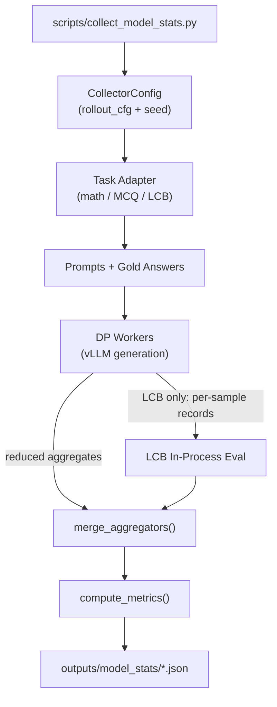

# Model Statistics Collector — Complete Implementation Plan

## Architecture Overview




---

## New Files

### `src/loop_probe/collector.py`

Defines all shared data types and aggregation logic.

```python
@dataclass(frozen=True)
class CollectorConfig:
    rollout_cfg: RolloutConfig
    seed: int
    task_kind: str        # "math_freeform" | "multiple_choice_gpqa" | ...
    statistics: list[str]
    livecodebench_repo: str | None = None
    release_version: str = "release_v6"
    lm_style_override: str | None = None  # overrides auto-detected LMStyle

@dataclass
class WorkerAggregator:
    # counts
    num_samples_seen: int = 0
    num_generated: int = 0
    num_graded: int = 0
    num_correct: int = 0
    num_wrong: int = 0
    num_looped: int = 0
    num_max_length_hits: int = 0
    num_prompt_too_long: int = 0
    num_correct_and_looped: int = 0
    num_correct_and_max_length_hit: int = 0
    # sums
    length_sum: int = 0
    length_sq_sum: int = 0    # enables exact variance = sq/n - (sum/n)^2
    loop_length_sum: int = 0
    correct_length_sum: int = 0
    wrong_length_sum: int = 0
    first_loop_prefix_sum: int = 0
    # LCB only — empty list for all non-LCB tasks
    lcb_sample_records: list[LcbSampleRecord] = field(default_factory=list)

@dataclass(frozen=True)
class LcbSampleRecord:
    question_id: str
    code_output: str      # already extract_code()-stripped; "" for skipped
    token_count: int
    loop_flag: bool
    finish_reason: str
    prompt_too_long: bool
```

`compute_metrics(agg, requested)` implements all formulas with the null rule: any metric whose denominator is zero emits `null`.  
Max-length-hit rule: `finish_reason == "length"` **and** `token_count == min(max_tokens, max_model_len - prompt_len)`.

---

### `src/loop_probe/prompt_builder.py`

Moves the shared math prompt into library code so `collect_model_stats.py` and future scripts do not reimplement it.

```python
def build_math_prompt(tokenizer, question: str) -> str:
    user_msg = f"{question}\n\nYou must put your final answer within \\boxed{{}}."
    return tokenizer.apply_chat_template(
        [{"role": "user", "content": user_msg}],
        tokenize=False, add_generation_prompt=True,
    )
```

---

### `src/loop_probe/adapters/__init__.py`

Empty; marks the adapters as a sub-package.

---

### `src/loop_probe/adapters/math_freeform.py`

- `preflight()`: `import math_verify`; raises `ImportError` with install hint on failure.
- `grade(response, gold_answer) -> bool`: calls `scripts/utils._math_verify`-equivalent logic; parse failure → `False` (so `num_graded == num_generated`).

---

### `src/loop_probe/adapters/multiple_choice_gpqa.py`

GPQA CSV columns: `Question`, `Correct Answer`, `Incorrect Answer 1/2/3` — no pre-assigned letters.

- `load_and_shuffle(spec, seed)` returns `list[tuple[SampleRecord, list[str], str]]` where each tuple is `(record, shuffled_options, gold_letter)`.  
Shuffle uses `random.Random(seed ^ sample_id)` for determinism; records shuffle policy and base seed in summary metadata.  
Requires explicit `--dataset-config` (e.g., `gpqa_main`, `gpqa_diamond`); raises on bare `Idavidrein/gpqa` without config.
- `build_mcq_prompt(tokenizer, question, options)` returns a chat-templated MCQ prompt with options labeled A–D.
- `grade(response, gold_letter) -> bool`: extract last standalone capital letter A–D from response; exact-match against `gold_letter`.

---

### `src/loop_probe/adapters/multiple_choice_mmlupro.py`

MMLU-Pro has 10 options (A–J) and fields `options`, `answer` (letter), `answer_index`.

- `build_mcq_prompt(tokenizer, question, options)` labels 10 choices A–J.
- `grade(response, gold_answer, gold_index) -> bool`: extract last capital letter A–J; match against `gold_answer` (primary) or `chr(ord("A") + gold_index)` (fallback).

---

### `src/loop_probe/adapters/livecodebench_codegen.py`

Houses the complete LCB in-process evaluation chain. Imports from the local checkout added to `sys.path` via `--livecodebench-repo`.

`**_get_lm_style(model_id)**` — prefix-based mapping, no registry lookup required:

```python
def _get_lm_style(model_id: str, override: str | None = None) -> LMStyle:
    if override:
        return LMStyle(override)
    if model_id.lower().startswith("qwen/"):
        return LMStyle.CodeQwenInstruct   # backtick extraction — correct for reasoning models
    return LMStyle.CodeQwenInstruct       # safe fallback
```

`**build_lcb_args(release_version)**` — constructs the `SimpleNamespace` required by LCB helpers, with every required field confirmed from source:

```python
SimpleNamespace(
    scenario=Scenario.codegeneration,
    release_version=release_version,
    not_fast=False,
    start_date=None,
    end_date=None,
    num_process_evaluate=4,
    timeout=5.0,
)
```

**Full in-process call chain** (all six steps, confirmed from `custom_evaluator.py` + `scenario_router.py`):

```
1. benchmark, _ = build_prompt_benchmark(args_ns)
   # benchmark is sorted by question_id
2. vLLM generates raw_text per problem
3. extracted = extract_code(raw_text, lm_style)  [or "" for prompt_too_long]
4. save_results = [instance.insert_output([extracted], [extracted])
                   for instance, extracted in zip(benchmark, extracted_codes)]
5. save_results, combined_results = sort_and_extract_save_results(
       Scenario.codegeneration, save_results)
6. metrics = get_metrics(Scenario.codegeneration, args_ns, benchmark, combined_results)
   # pass@1 = metrics[0]["pass@1"]
7. graded = extract_instance_results(metrics[1])
   # graded[i] is True/False per benchmark problem
```

**LCB DP join** (parent-side, after all workers finish):

```
lcb_records sorted by question_id
→ assemble extracted_codes (in benchmark order)
→ steps 4–7 above
→ join graded[i] onto lcb_records[i] to set num_correct, num_correct_and_looped, etc.
```

`**preflight(repo_path, release_version)**` — inserts repo into `sys.path`, then calls `build_prompt_benchmark` with a dry-run namespace. If HF/cache is unavailable, fails before vLLM init.

---

### `scripts/collect_model_stats.py`

CLI entrypoint. Preflight order mirrors the plan:

1. Dataset auth/cache/path checks (`HF_TOKEN`, `HF_DATASETS_CACHE`, repo path).
2. Dependency checks (`vllm`; `math_verify` for `math_freeform`; LCB benchmark load for LCB).
3. vLLM/model init.

**Output filename pattern**: `outputs/model_stats/{dataset_slug}__{config_slug}__{split}__{model_slug}.json`  
e.g. `TIGER-Lab_MMLU-Pro__test__Qwen_Qwen3.5-2B.json`

**Default generation config**: `model_id=Qwen/Qwen3.5-2B`, `temperature=0.0`, `max_tokens=81920`, `max_model_len=262144`, `dtype=bfloat16`, `trust_remote_code=True`.

**Output JSON schema**:

```json
{
  "metadata": { "dataset": ..., "config": ..., "split": ..., "task_kind": ...,
                "model_id": ..., "generation_config": {...}, "seed": ...,
                "loop_detector": {"n": 30, "k": 20},
                "shuffle_policy": {...},   // GPQA only
                "lm_style": ...,           // LCB only
                "timestamp": "..." },
  "counts": { "num_samples": ..., "num_generated": ..., "num_graded": ...,
              "num_correct": ..., "num_looped": ..., "num_max_length_hits": ...,
              "num_prompt_too_long": ... },
  "metrics": { "success_fraction": ..., "loop_fraction": ..., ... }
}
```

---

### `slurm/run_collect_model_stats.sbatch`

Based on `[slurm/run_vllm_generate.sbatch](slurm/run_vllm_generate.sbatch)` with a 1-GPU default (`--gres=gpu:1`).

Env vars added vs. the existing template:

- `HF_TOKEN` — for GPQA gated access
- `HF_DATASETS_CACHE` — for LCB fast-path dataset
- `LIVECODEBENCH_REPO` — path to local LCB checkout
- `STATISTICS`, `TASK_KIND`, `DATASET`, `DATASET_CONFIG`, `SPLIT`, `RELEASE_VERSION`

---

## Modified Files

### `[scripts/utils.py](scripts/utils.py)`

Remove lines 175–198 (the inline `has_ngram_loop` body) and replace with:

```python
from loop_probe.labeling import has_ngram_loop
```

Behavior is identical; the import is the single canonical implementation.

---

## Metric Formulas (reference)


| Metric                            | Formula                                                     | Null when                  |
| --------------------------------- | ----------------------------------------------------------- | -------------------------- |
| `success_fraction`                | QA: `num_correct / num_graded`; LCB: `metrics[0]["pass@1"]` | `num_graded == 0`          |
| `loop_fraction`                   | `num_looped / num_generated`                                | `num_generated == 0`       |
| `avg_generation_length`           | `length_sum / num_generated`                                | `num_generated == 0`       |
| `avg_loop_generation_length`      | `loop_length_sum / num_looped`                              | `num_looped == 0`          |
| `avg_first_loop_prefix_length`    | `first_loop_prefix_sum / num_looped`                        | `num_looped == 0`          |
| `max_length_hit_fraction`         | `num_max_length_hits / num_generated`                       | `num_generated == 0`       |
| `generation_length_variance`      | `length_sq_sum/n - (length_sum/n)^2`                        | `num_generated == 0`       |
| `max_length_hit_success_fraction` | `num_correct_and_max_length_hit / num_max_length_hits`      | `num_max_length_hits == 0` |
| `loop_success_fraction`           | `num_correct_and_looped / num_looped`                       | `num_looped == 0`          |
| `avg_correct_generation_length`   | `correct_length_sum / num_correct`                          | `num_correct == 0`         |
| `avg_wrong_generation_length`     | `wrong_length_sum / num_wrong`                              | `num_wrong == 0`           |


